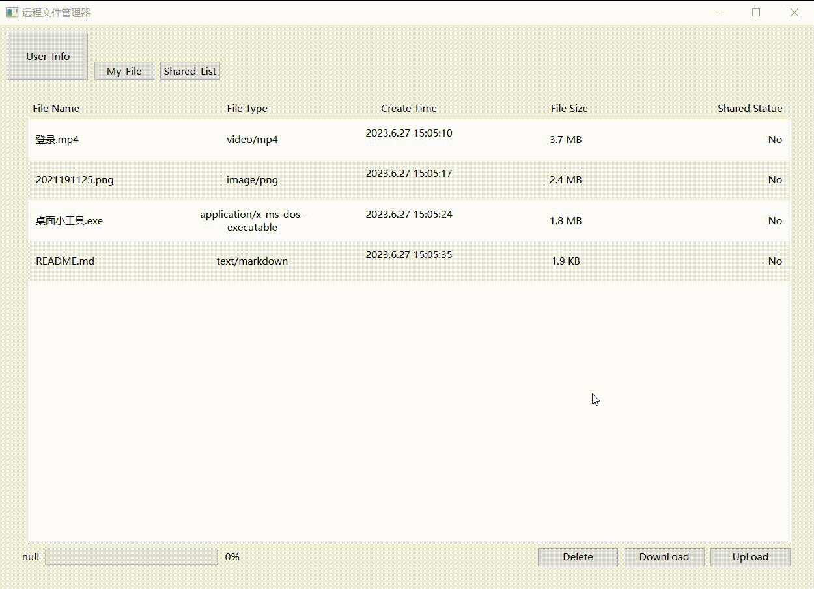
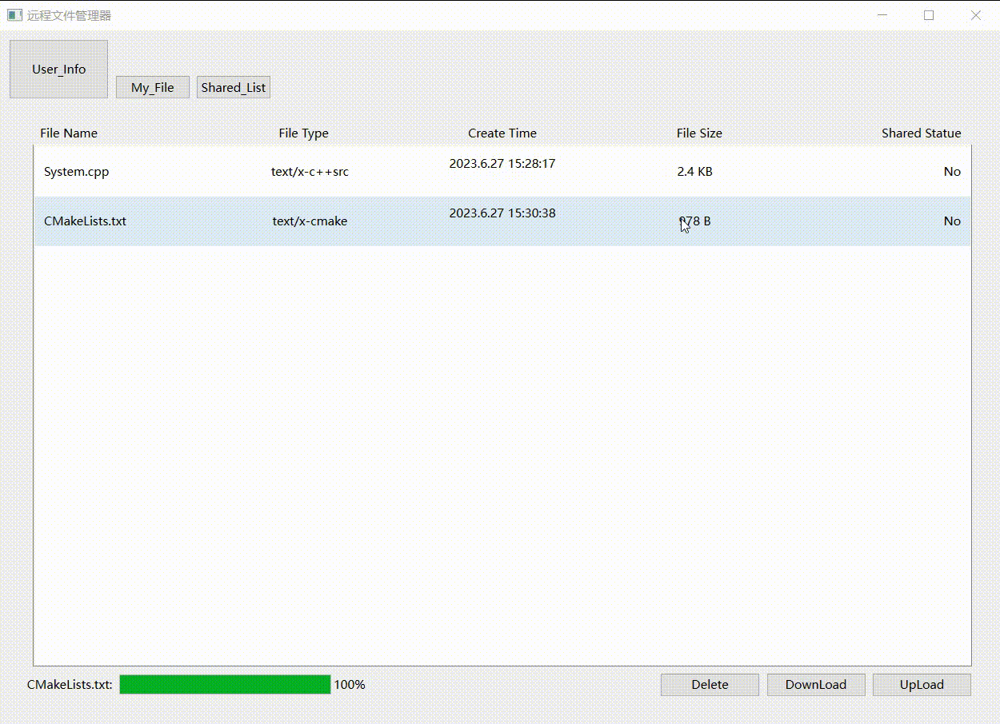

# 项目简介  

- 该项目是一个远程的文件管理服务器,可以让用户在登录账户后再服务器上进行文件的存储,下载,共享等操作  

- 该项目后端使用`NGIX`作为服务器,通过`Fast_CGI与CGI`程序处理动态请求并使用`Spawn_CGI`进行管理,使用 `Fast_DFS` 管理文件的存储  

- 数据库采用 `MYSQL`  

- 通过计算文件MD5实现相同文件的秒传,提高服务器资源利用率和用户体验  

- 支持 1G 左右文件的快速传输  

 
 

# 项目演示
## 登录
)

 
 
 

## 上传文件

 
 
 

## 下载文件

 
 
 

## 共享与取消共享文件

 
 
 

## 其他

 
 
 

# 项目依赖
        Server:Nginx,Fast_DFS,Spawn_CGI,Fast_CGI,MYSQL
        
        Client:Qt,MYSQL

